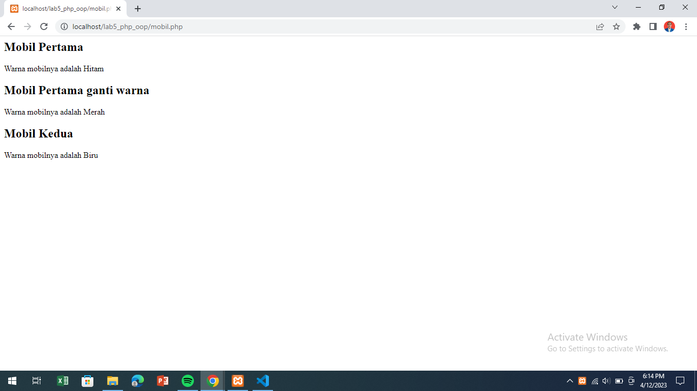
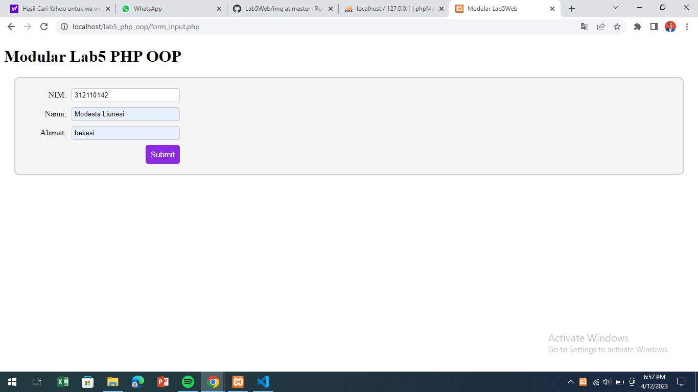

<<<<<<< HEAD
# Tugas Pemograman Web 2
## Profil
| #               | Biodata           |
| --------------- | ----------------- |
| **Nama**        | Modesta Liunesi   |
| **NIM**         | 312110142        |
| **Kelas**       | TI.21.A.1         |
| **Mata Kuliah** | Pemrograman Web 2 |

# Persiapan 
1. Persiapkan Text Editor misalnya VSCode.
2. Buat folder baru dengan nama Lab5Web pada root Web Server (htdocs).
3. Ikuti langkah-langkah praktikum yang akan dijelaskan berikutnya.

## Class Dasar
- Buat file baru dengan nama `mobil.php`. Kemudian masukan kode berikut.

```php
<?php

class Mobil
{
    private $warna;
    private $merk;
    private $harga;

    public function __construct()
    {
        $this->warna = "Hitam";
        $this->merk = "SSC_Tuatara";
        $this->harga = "29500000000";
    }

    public function set_warna($value)
    {
        $this->warna = $value;
    }

    public function get_warna()
    {
        return "Warna mobilnya adalah " . $this->warna;
    }
}

$mobil_pertama = new Mobil();
$mobil_kedua = new Mobil();
?>

<h2>Mobil Pertama</h2>

<?= $mobil_pertama->get_warna(); ?>

<h2>Mobil Pertama ganti warna</h2>

<?php
$mobil_pertama->set_warna("Merah");
echo $mobil_pertama->get_warna(); 
?>

<h2>Mobil Kedua</h2>

<?php
$mobil_kedua->set_warna("Biru");
echo $mobil_kedua->get_warna();
```

- Maka hasilnya seperti berikut.


## Membuat Form (Class Library)
<p>Class library merupakan pustaka kode program yang dapat digunakan bersama pada beberapa file
yang berbeda (konsep modularisasi). Class library menyimpan fungsi-fungsi atau class object
komponen untuk memudahkan dalam proses development aplikasi.</p>

- Buat file baru dengan nama `form-input.php`. Kemudian masukan kode berikut.

```php
<?php
require_once 'includes/database.php';
require_once 'includes/form.php';

$db = new Database();
$conn = $db->getConnection();
$form = new Form($conn);
?>

<!DOCTYPE html>
<html>
<head>
	<title>Modular Lab5Web</title>
  <link rel="stylesheet" type="text/css" href="includes/form.css">
</head>
<body>
	<h1>Modular Lab5Web</h1>
	<?php
	if ($_SERVER['REQUEST_METHOD'] == 'POST') {
		$form->processForm($_POST);
	}
	$form->displayForm();
	?>
</body>
</html>
```

- Buat folder baru di dalam folder `Lab5Web` dengan nama `includes`.
- Kemudian, buat file baru di dalam folder `includes` dengan nama `config.php`.
- Isi file `config.php` dengan kode berikut:

```php
<?php
/**
 * Program sederhana pendefinisian class dan pemanggilan class.
 **/
class Mobil
{
    private $warna;
    private $merk;
    private $harga;
    public function __construct()
    {
        $this->warna = "Biru";
        $this->merk = "BMW";
        $this->harga = "10000000";
    }
    public function gantiWarna($warnaBaru)
    {
        $this->warna = $warnaBaru;
    }
    public function tampilWarna()
    {
        echo "Warna mobilnya : " . $this->warna;
    }
}

// membuat objek mobil
$a = new Mobil();
$b = new Mobil();

// memanggil objek
echo "<b>Mobil pertama</b><br>";
$a->tampilWarna();
echo "<br>Mobil pertama ganti warna<br>";
$a->gantiWarna("Merah");
$a->tampilWarna();

// memanggil objek
echo "<br><b>Mobil kedua</b><br>";
$b->gantiWarna("Hijau");
$b->tampilWarna();

?>
```

- Maka hasilnya seperti berikut.


## Class Library
<P>Class library merupakan pustaka kode program yang dapat digunakan bersama pada beberapa file
yang berbeda (konsep modularisasi). Class library menyimpan fungsi-fungsi atau class object
komponen untuk memudahkan dalam proses development aplikasi.</p>

- Buat file baru dengan nama `form_input.php`. kemudian masukan kode berikut.

```php
<?php
require_once 'includes/database.php';
require_once 'includes/form.php';

$db = new Database();
$conn = $db->getConnection();
$form = new Form($conn);
?>

<!DOCTYPE html>
<html>

<head>
	<title>Modular Lab5Web</title>
	<link rel="stylesheet" type="text/css" href="includes/form.css">
</head>

<body>
	<h1>Modular Lab5 PHP OOP</h1>
	<?php
	if ($_SERVER['REQUEST_METHOD'] == 'POST') {
		$form->processForm($_POST);
	}
	$form->displayForm();
	?>
</body>

</html>
```

- Buat folder baru di dalam folder `Lab5Web` dengan nama `includes`.
- Kemudian, buat file baru di dalam folder `includes` dengan nama `config.php`.
- Isi file `config.php` dengan kode berikut:

```php
<?php
define('DB_HOST', 'localhost');
define('DB_USER', 'root');
define('DB_PASS', '');
define('DB_NAME', 'latihan1');
?>
```

- Kemudian, buat koneksi ke database pada file `database.php` dengan kode berikut:

```php
<?php
require_once 'config.php';

class Database
{
	private $conn;

	public function __construct()
	{
		$this->conn = new mysqli(DB_HOST, DB_USER, DB_PASS, DB_NAME);
		if ($this->conn->connect_error) {
			die('Connection failed: ' . $this->conn->connect_error);
		}
	}

	public function getConnection()
	{
		return $this->conn;
	}
}
?>
```

- Lalu buat file baru di dalam folder `includes` dengan nama `form.php`. Dan masukan kode berikut.

```php
<?php
class Form
{
	private $conn;

	public function __construct($conn)
	{
		$this->conn = $conn;
	}

	public function displayForm()
	{
		echo '<form method="POST" action="index.php?mod=form">';
		echo '<label for="nim">NIM:</label>';
		echo '<input type="number" name="nim" required><br>';
		echo '<label for="nama">Nama:</label>';
		echo '<input type="text" name="nama" required><br>';
		echo '<label for="alamat">Alamat:</label>';
		echo '<input type="text" name="alamat" required><br>';
		echo '<input type="submit" value="Submit">';
		echo '</form>';
	}

	public function processForm($data)
	{
		$nim = $data['nim'];
		$nama = $data['nama'];
		$alamat = $data['alamat'];

		$sql = 'INSERT INTO data_mahasiswa (nim, nama, alamat) VALUES (?, ?, ?)';
		$stmt = $this->conn->prepare($sql);
		$stmt->bind_param('sss', $nim, $nama, $alamat);
		$stmt->execute();

		header('Location: index.php?mod=home');
	}
}
?>
```

- Maka hasilnya akan seperti ini.





# Terima Kasih!
=======
# Lab5-oop
>>>>>>> 75fb4af02e95df927f3aae5df173f167713fd86b
